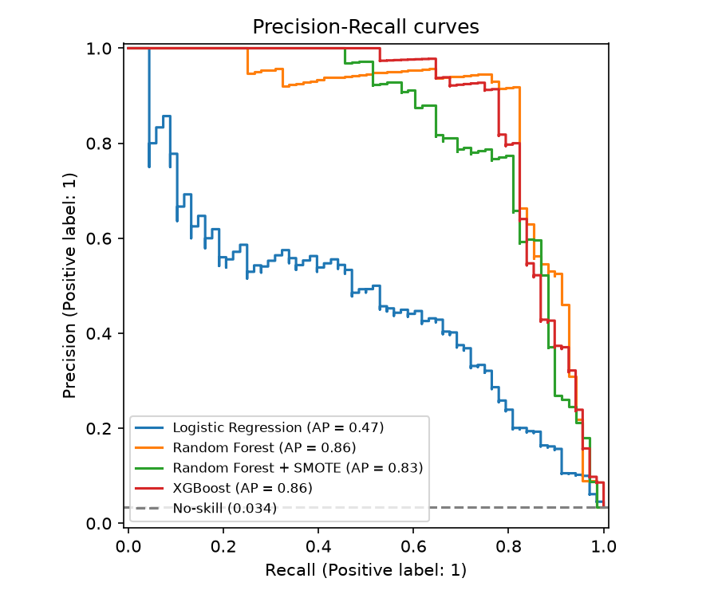
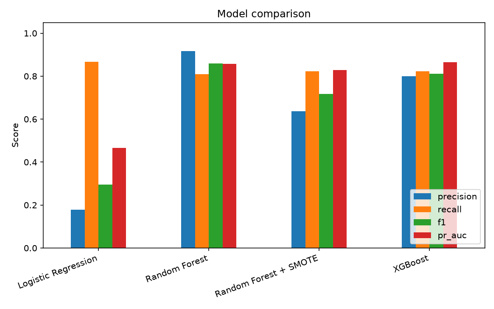
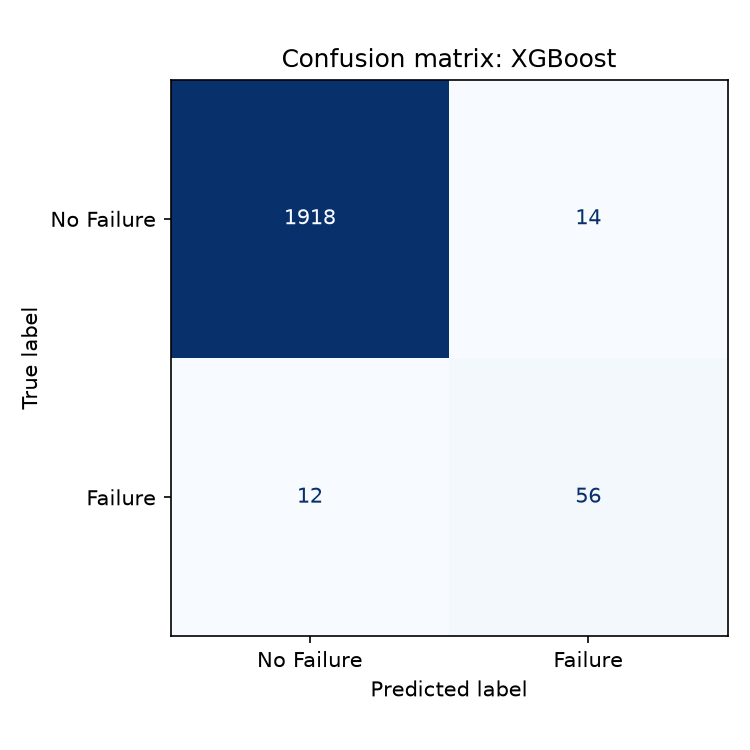

# Predictive Maintenance: Failure-Risk Classifier

Predicts the probability that an industrial milling machine will fail in its current
operating state, from live sensor readings (temperatures, rotational speed, torque, tool
wear). Trained and evaluated on the AI4I 2020 dataset, served through a FastAPI endpoint.

**Best model (XGBoost): 0.80 precision, 0.82 recall, 0.86 PR-AUC at a 3.4% failure rate on
a held-out test set.**

Predictive maintenance is one of the most common production ML use cases in Western
Australia's resources sector (Rio Tinto and BHP both run it at scale on fixed-plant and
mobile-fleet equipment), which is why this project exists: a compact, honestly-evaluated
demonstration of the full pipeline — EDA, imbalance-aware modeling, evaluation that doesn't
hide behind accuracy, and a working served endpoint.



## Problem statement

Given a snapshot of sensor readings, flag machines at elevated risk of failure so
maintenance can be scheduled proactively instead of reactively. This is a **binary
classification problem on point-in-time sensor snapshots**, not a survival-analysis or
remaining-useful-life regression problem — the dataset has no run-to-failure time series,
so RUL-in-hours estimates are not something this data supports. Framing it otherwise would
overstate what the model can do.

## Dataset

[AI4I 2020 Predictive Maintenance Dataset](https://archive.ics.uci.edu/dataset/601/ai4i+2020+predictive+maintenance+dataset)
— 10,000 rows synthesised to mirror real milling-machine operating data, from the UCI
Machine Learning Repository.

> S. Matzka, "Explainable Artificial Intelligence for Predictive Maintenance Applications,"
> 2020 Third International Conference on Artificial Intelligence for Industries (AI4I),
> 2020, pp. 69-74.

10 columns: a product ID and quality variant (`Type`: Low/Medium/High), four sensor
readings (air temperature, process temperature, rotational speed, torque, tool wear), a
binary `Target` (machine failure yes/no), and a `Failure Type` column naming the specific
failure mode for positive rows. **Only 3.4% of rows are a failure** — this drives nearly
every downstream decision (see Approach).

The dataset also has two documented internal inconsistencies between `Target` and
`Failure Type` (18 rows tagged `Random Failures` with `Target == 0`; 9 rows with
`Target == 1` but `Failure Type == "No Failure"`). These are kept, not dropped, but
explicitly flagged in `src/data.py::flag_label_inconsistencies` — see `BUILD_LOG.md`.

Download it yourself (not committed to this repo — see `data/` note below):

```bash
mkdir -p data
curl -o data/predictive_maintenance.csv \
  https://raw.githubusercontent.com/michele-abruzzese/predictive_maintenance/main/predictive_maintenance.csv
```

## Approach

1. **EDA** (`notebooks/01_eda.ipynb`, `src/eda.py`) — class balance, per-feature
   distributions split by failure status, correlation matrix, failure-type breakdown,
   failure rate by product quality type.
2. **Feature engineering** (`src/data.py`) — two physically-motivated features on top of
   the raw sensors: `Power [W]` (torque × angular velocity — the dataset's own Power
   Failure mode is defined by power falling outside a normal band) and `Temp difference [K]`
   (process − air temperature — relevant to the Heat Dissipation Failure mode).
3. **Preprocessing** (`src/preprocessing.py`) — one-hot encode `Type`, standard-scale
   numeric features, **stratified** train/test split (a plain random split risks a test
   fold with too few of the 339 total failures to evaluate reliably).
4. **Modeling** (`src/train.py`) — four models, all with explicit imbalance handling:
   - Logistic Regression, `class_weight="balanced"` (interpretable baseline)
   - Random Forest, `class_weight="balanced"`
   - Random Forest + **SMOTE** oversampling (imblearn pipeline) — included specifically to
     compare synthetic minority oversampling against class-weighting on this dataset
   - XGBoost, `scale_pos_weight` set to the train-set negative:positive ratio
5. **Evaluation** (`src/evaluate.py`) — precision, recall, F1, ROC-AUC, and **PR-AUC**
   (the primary ranking metric — far more informative than ROC-AUC at 3.4% positive rate,
   since ROC-AUC can look deceptively high while precision at usable recall is still weak).
   Confusion matrices and a per-failure-type recall breakdown for every model.
6. **Serving** (`src/serve.py`) — a FastAPI `/predict` endpoint that takes raw sensor
   readings, applies the same feature engineering used in training, and returns a
   probability, thresholded label, and risk tier.

## Results

Held-out test set: 2,000 rows, 68 true failures (3.4%), stratified from the same split
used across all four models. Numbers below are exact `models/metrics.json` output from
`python -m src.train` — not rounded favorably.

| Model | Precision | Recall | F1 | ROC-AUC | PR-AUC |
|---|---|---|---|---|---|
| Logistic Regression | 0.178 | 0.868 | 0.295 | 0.934 | 0.466 |
| Random Forest | **0.917** | 0.809 | 0.859 | 0.975 | 0.858 |
| Random Forest + SMOTE | 0.636 | 0.824 | 0.718 | 0.972 | 0.829 |
| **XGBoost (best)** | 0.800 | 0.824 | 0.812 | **0.980** | **0.864** |

XGBoost was selected as the best model by PR-AUC on the held-out test set. The
class-weighted Logistic Regression baseline is a useful contrast: it catches almost as many
failures as XGBoost (recall 0.87 vs 0.82) but at the cost of swamping any human reviewer
with false alarms (precision 0.18 — roughly 4 false alarms per true failure caught).
Class-weighted Random Forest actually posts the highest *precision* of the four, but
XGBoost edges it out on the metric this project optimises for (PR-AUC) and on recall.

Interestingly, plain class-weighting outperformed SMOTE oversampling on Random Forest here
(PR-AUC 0.858 vs 0.829) — on a dataset this small (8,000 training rows, ~270 real positive
examples), SMOTE's synthetic neighbors add noise faster than they add signal. Worth keeping
in mind: SMOTE is not a strictly-better default, it is a tool that sometimes underperforms
simple class-weighting.





### Per-failure-type recall (XGBoost, on the 68 true test-set failures)

| Failure type | Support (test) | Recall |
|---|---|---|
| Heat Dissipation Failure | 28 | 0.96 |
| Overstrain Failure | 15 | 1.00 |
| Power Failure | 13 | 1.00 |
| Tool Wear Failure | 10 | **0.10** |
| "No Failure" but Target=1 (known label inconsistency) | 2 | 0.00 |

Tool Wear Failure is the clear weak point — full detail and numbers in `MODEL_CARD.md`.

## How to run

```bash
python -m venv .venv
.venv/Scripts/activate        # .venv\Scripts\activate.ps1 on PowerShell; source .venv/bin/activate on macOS/Linux
pip install -r requirements.txt

mkdir -p data
curl -o data/predictive_maintenance.csv \
  https://raw.githubusercontent.com/michele-abruzzese/predictive_maintenance/main/predictive_maintenance.csv

python -m src.eda      # regenerates figures/ EDA plots
python -m src.train    # trains all 4 models, writes models/, regenerates result figures
pytest tests/ -v       # 25 tests

uvicorn src.serve:app --reload
# then: curl -X POST http://127.0.0.1:8000/predict -H "Content-Type: application/json" -d '{
#   "type": "M", "air_temperature_k": 298.1, "process_temperature_k": 308.6,
#   "rotational_speed_rpm": 1551, "torque_nm": 42.8, "tool_wear_min": 0
# }'
```

`data/` and `models/` are gitignored — regenerate both from the commands above.

## What I'd improve with more time

- **More failure-type training data.** Tool Wear Failure (45 total examples) and Random
  Failures (18) are too sparse for any model to learn reliably — see `MODEL_CARD.md` for
  the quantified gap. A larger or targeted dataset would matter more than further model
  tuning at this point.
- **Threshold tuning per use case.** The API currently thresholds at 0.5; in a real
  deployment the threshold should be chosen against the actual cost ratio of a missed
  failure vs. a false alarm (maintenance downtime cost vs. unplanned-failure cost), not a
  default.
- **Calibration.** Predicted probabilities aren't currently calibrated (e.g. via Platt
  scaling / isotonic regression) — for a risk *tier* they're good enough, but a dashboard
  quoting "73% failure probability" as a real probability would need calibration checked.
- **Time-aware validation.** This is snapshot data with no timestamps, so a random
  stratified split is the correct choice here — but a production version fed from a real
  fleet should validate with a time-based split to catch drift.
- **Hyperparameter search.** All models use reasonable defaults / light manual tuning, not
  a systematic search (e.g. Optuna) — there's likely a bit more PR-AUC on the table.
- **CI.** No GitHub Actions workflow yet to run `pytest` on every push.

## Repo structure

```
predictive-maintenance/
├── README.md
├── MODEL_CARD.md
├── BUILD_LOG.md
├── SUMMARY.md
├── requirements.txt
├── .gitignore
├── src/            # loading, feature engineering, preprocessing, training, evaluation, serving
├── notebooks/       # EDA notebook (imports src/, doesn't duplicate logic)
├── figures/         # all plots referenced above, regenerable via src/eda.py and src/train.py
├── tests/           # pytest, 25 real-assertion tests
├── data/            # gitignored -- see download command above
└── models/          # gitignored -- see `python -m src.train` above
```
